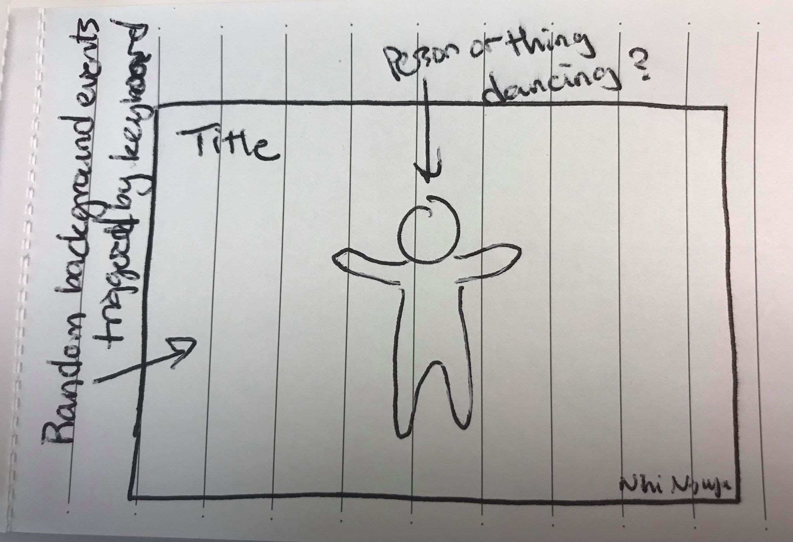

# Music App

Make a keyboard that can play sounds
Can use Web Audio API to make a keyboard with set of tones or use sound files.
Have users be able to choose (radio buttons or scroll) between tone types (sawtooth, triangle, etc)
Or have users select from sounds files I uploaded (undertale, histheme, portal?)

Create something cool looking on the page??? 
Animated on the screen as users play with the keyboard (have it react to keypresses)

# User Stories
   As a user, I want to be able to play notes with my keyboard.
   As a user, I want the screen to have something interesting occur with my notes.

# MVP
   - Have keys play sounds/notes
   - Have some kind of event happening on the screen triggered by keyboard
# Bronze
   - Allow users to select types of sounds/notes (xylophone, piano, dubstep, etc)
# Silver
   - Have users be able to play notes back (like a temporary save system in place)
# Gold
   - Be able to save files with music played

# Build
React.js, CSS, and JSX - written in Virtual Studio Code.